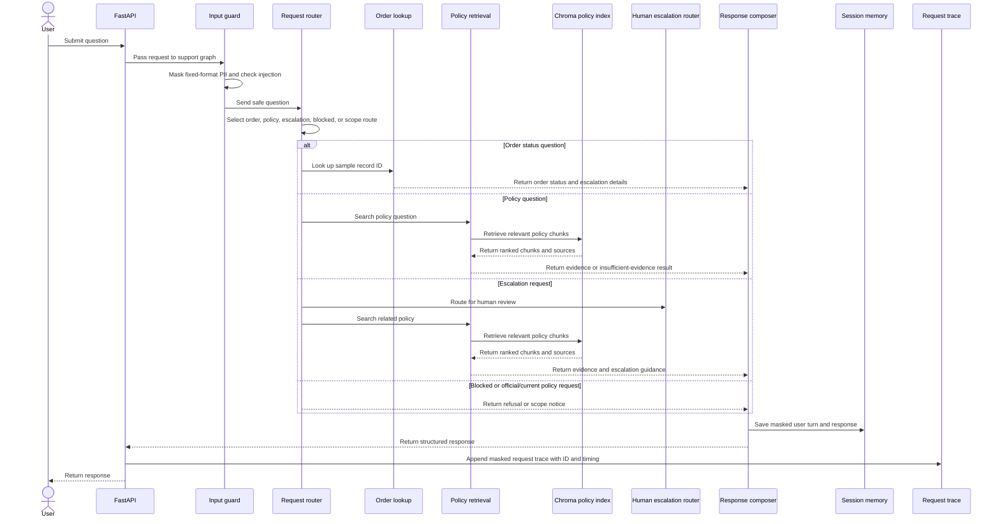

# Nykaa support request sequence

```mermaid
sequenceDiagram
    actor User
    participant API as FastAPI
    participant Guard as Input guard
    participant Router as Request router
    participant Orders as Order lookup
    participant RAG as Policy retrieval
    participant KB as Chroma policy index
    participant Escalation as Human escalation router
    participant Composer as Response composer
    participant Memory as Session memory
    participant Trace as Request trace

    User->>API: Submit question
    API->>Guard: Pass request to support graph
    Guard->>Guard: Mask fixed-format PII and check injection
    Guard->>Router: Send safe question
    Router->>Router: Select order, policy, escalation, blocked, or scope route

    alt Order status question
        Router->>Orders: Look up sample record ID
        Orders-->>Composer: Return order status and escalation details
    else Policy question
        Router->>RAG: Search policy question
        RAG->>KB: Retrieve relevant policy chunks
        KB-->>RAG: Return ranked chunks and sources
        RAG-->>Composer: Return evidence or insufficient-evidence result
    else Escalation request
        Router->>Escalation: Route for human review
        Router->>RAG: Search related policy
        RAG->>KB: Retrieve relevant policy chunks
        KB-->>RAG: Return ranked chunks and sources
        RAG-->>Composer: Return evidence and escalation guidance
    else Blocked or official/current policy request
        Router-->>Composer: Return refusal or scope notice
    end

    Composer->>Memory: Save masked user turn and response
    Composer-->>API: Return structured response
    API->>Trace: Append masked request trace with ID and timing
    API-->>User: Return response
```
